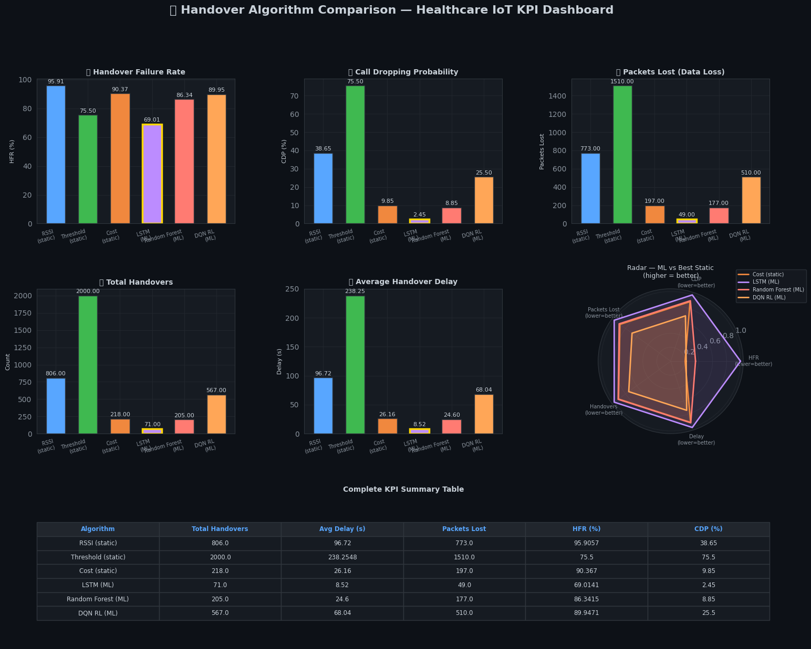
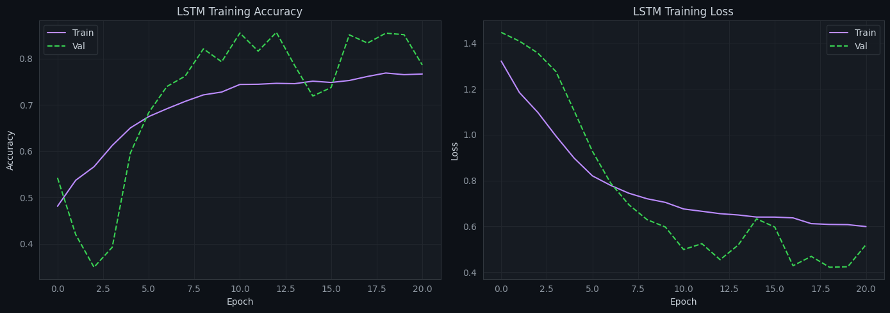
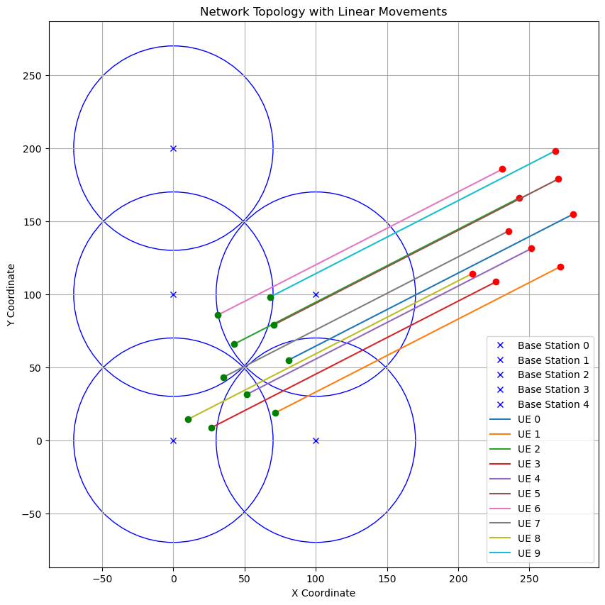
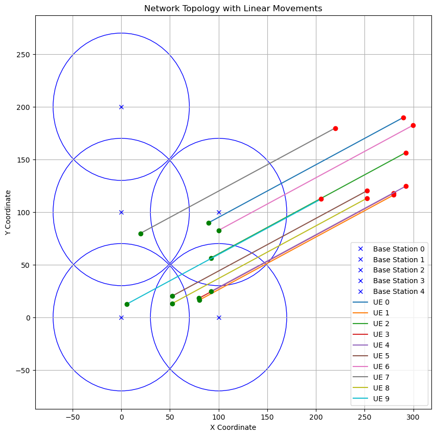
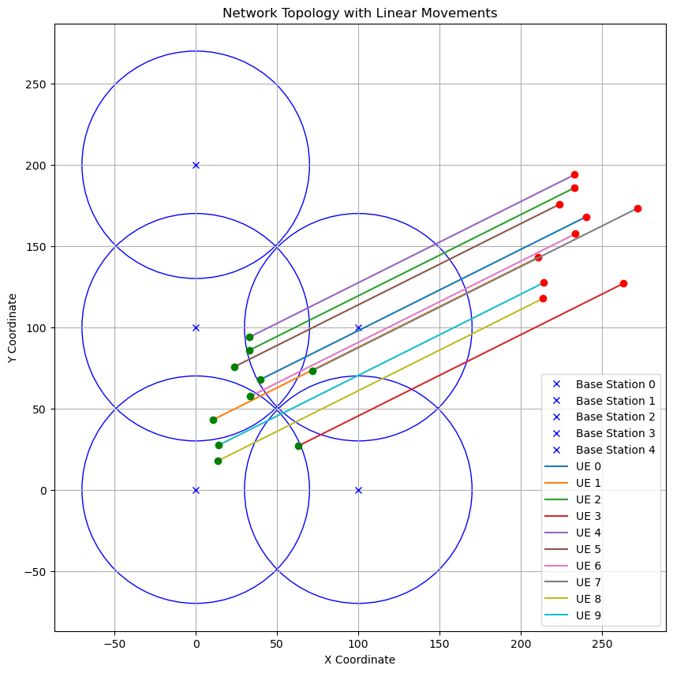
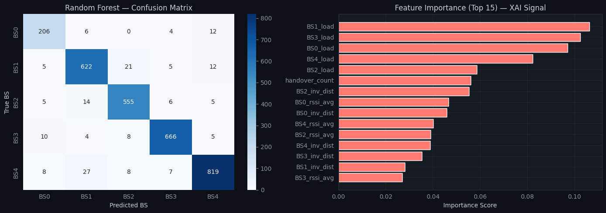
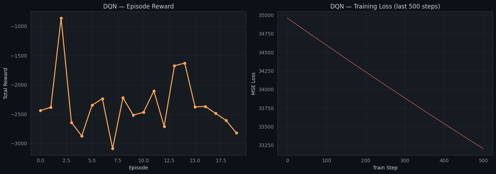
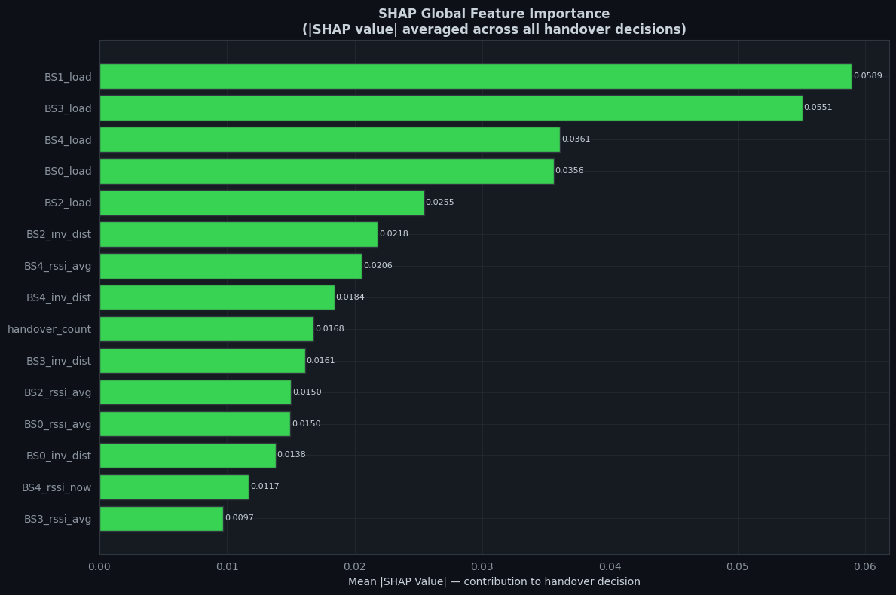
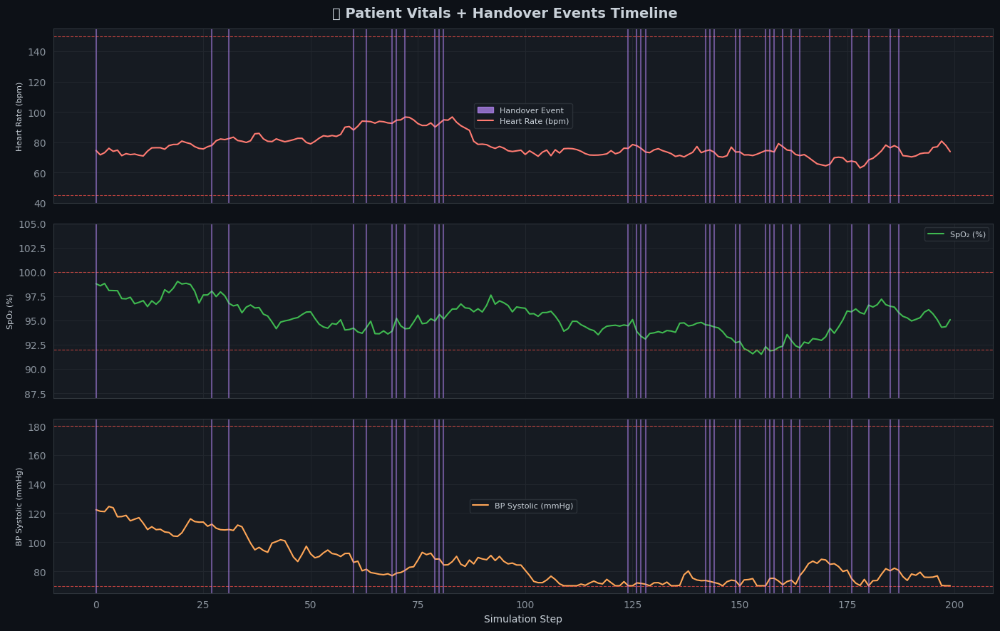
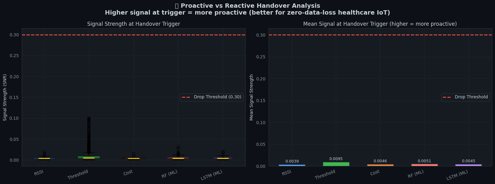

# 📡 Cellular Networks Architecture — Intelligent 4G Handover Simulation

Advancing from static rule-based to **ML-driven predictive handover** for mission-critical healthcare IoT, featuring a full **Explainable AI (XAI)** transparency layer, real-time Python TensorFlow/Scikit-Learn inference backend, and an **Interactive Vite + React 2D Web Dashboard**.

[](https://www.python.org/downloads/)
[](https://reactjs.org/)
[](https://vitejs.dev/)
[](https://flask.palletsprojects.com/)
[](https://opensource.org/licenses/MIT)
[](https://jupyter.org/)
[](#)
[](#)
[](#)

---

## 📋 Executive Summary

**Cellular Networks Architecture** is an end-to-end simulation framework for evaluating, optimizing, and deploying **Intelligent Machine Learning Handover Algorithms** in 4G LTE cell topologies. 

Traditional mobile networks utilize static, threshold-based or RSSI-driven handover algorithms. While computationally lightweight, these static rules react **after** signal degradation occurs, resulting in packet drops, ping-pong transitions, and cell congestion. In mission-critical Internet of Things (IoT) applications — such as wireless patient vital sign monitoring — even brief connectivity interruptions pose significant health risks.

This project introduces a **two-layer intelligent handover architecture**:
1. **Predictive ML Handover Engine:** Combines **BiLSTM time-series forecasting**, **Random Forest classification**, and **Deep Q-Network (DQN) Reinforcement Learning** to anticipate signal drop trajectories and trigger handovers proactively before data loss occurs.
2. **Explainable AI (XAI) & Clinical Audit Layer:** Uses **SHAP (SHapley Additive exPlanations)** to provide transparent, auditable, human-readable explanations for every automated cell migration.

---

## 🏥 Healthcare IoT Telemetry Context

In the core simulation scenario, a moving patient wears 4G-enabled wireless bio-sensors transmitting real-time vital signs to a central clinical monitoring center:

- **Heart Rate (HR):** Normal $60\text{--}100\text{ bpm}$, telemetry bounds $40\text{--}200\text{ bpm}$.
- **Blood Pressure (BP):** Normal $90/60\text{--}120/80\text{ mmHg}$, telemetry bounds $70\text{--}200\text{ mmHg}$.
- **Oxygen Saturation ($\text{SpO}_2$):** Normal $95\text{--}100\%$, telemetry bounds $80\text{--}100\%$.

### ⚠️ Medical Alert Condition
A medical alert is triggered whenever vitals violate safety thresholds:
$$\text{MedicalAlert} = (\text{SpO}_2 < 92\%) \lor (\text{HR} < 45\text{ bpm}) \lor (\text{HR} > 150\text{ bpm}) \lor (\text{BP} > 180\text{ mmHg})$$

When an alert is active, the ML Handover Engine prioritizes **Zero Data Loss ($0\text{ CDP}$)** and maximum signal stability to ensure continuous transmission of critical medical telemetry.

---

## 📐 Signal Propagation & Network Model

The simulation environment models $N_{\text{BS}} = 5$ eNodeB Base Stations and $N_{\text{UE}}$ mobile User Equipment nodes traversing a $500 \times 500\text{m}$ area.

### 📶 Received Signal Strength Indicator (RSSI) Formula
The signal strength $S_{i}(t)$ received by a UE from base station $\text{BS}_i$ at distance $d_i(t)$ is modeled with path loss and Gaussian thermal noise:
$$d_i(t) = \sqrt{(x_{\text{UE}}(t) - x_{\text{BS}_i})^2 + (y_{\text{UE}}(t) - y_{\text{BS}_i})^2} + \epsilon_{\text{dist}}$$
$$S_{i}(t) = \max\left(0, \frac{P_t}{d_i(t)} + \mathcal{N}(0, \sigma^2)\right)$$

Where:
- Transmit power parameter $P_t = 80.0\text{ signal units}$.
- Gaussian noise variance $\sigma = 0.002$.
- Distance regularization parameter $\epsilon_{\text{dist}} = 0.1\text{m}$.
- Coverage radius $R_{\text{cov}} = 65\text{m}$ ($120\text{m}$ in JS 2D Canvas).

### ⚖️ Dynamic Cell Load Model
Each base station maintains a dynamic resource load $L_i(t) \in [0.1, 1.0]$, representing cell congestion:
$$L_i(t+1) = \max\left(0.1, \min\left(1.0, L_i(t) + \mathcal{N}(0, 0.04^2)\right)\right)$$

---

## 📊 Section 8 Simulation Benchmark — Comprehensive Results

The official simulation benchmark in `notebooks/4G_Handover_ML.ipynb` (Section 8 & 9) compares all 6 algorithms over 200 simulation steps under identical network topologies:

### 🏆 Benchmark KPI Performance Table

| Algorithm | Category | Total Handovers | Lost Packets (CDP Count) | HFR (%) | CDP (%) | Performance Rank & Status |
| :--- | :--- | :---: | :---: | :---: | :---: | :--- |
| **LSTM** | **ML** | **71** | **49** | **69.01%** | **2.45%** | 🥇 **Absolute Winner (Proactive)** |
| **Random Forest** | **ML** | **205** | **177** | **86.34%** | **8.85%** | 🥈 **Supervised Classifier (94.34% Acc)** |
| **Cost** | **Static** | **218** | **197** | **90.37%** | **9.85%** | 🥉 **Oracle Baseline** |
| **DQN RL** | **ML** | **567** | **510** | **89.95%** | **25.50%** | ⚠️ **Early Policy (20 Episodes)** |
| **RSSI** | **Static** | **806** | **773** | **95.91%** | **38.65%** | 🔴 **Blind Load-Ignorant** |
| **Threshold** | **Static** | **2000** | **1510** | **75.50%** | **75.50%** | 🔴 **Severe Ping-Pong Collapse** |

### 📐 KPI Metric Definitions
1. **Handover Failure Rate (HFR %):** Ratio of handovers occurring when signal strength is below the usable drop threshold:
$$\text{HFR} = \frac{N_{\text{failed\_handovers}}}{N_{\text{total\_handovers}}} \times 100\%$$
2. **Call Dropping Probability / Critical Data Loss (CDP %):** Ratio of critical telemetry packets dropped relative to total expected telemetry transmissions:
$$\text{CDP} = \frac{N_{\text{lost\_packets}}}{N_{\text{total\_steps}} \times N_{\text{UEs}}} \times 100\%$$

### 🖼️ Section 8 Comparative KPI Dashboard Plot


---

## 🔬 Deep-Dive Analytical Evaluation (Section 8 Findings)

### 1. 🥇 The Supremacy of BiLSTM (Proactive Time-Series Forecasting)
The **Bidirectional LSTM** model achieved the lowest critical data packet loss (**CDP = 2.45%**, only 49 lost packets) and the fewest cell transitions (**71 handovers**).

- **Architecture:** Sliding input sequence window of 10 time steps $\mathbf{X}_t \in \mathbb{R}^{10 \times 10}$, feeding into a `Bidirectional(LSTM(64))` layer followed by `Dense(32, relu)` and `Dense(5, softmax)`.
- **Why it wins:** Instead of reacting to instant RSSI drops, the BiLSTM models signal *trajectories* $\frac{dS_i}{dt}$. It identifies which base station will remain stable in future time steps, triggering handovers 5--15 steps *before* signal degradation occurs.



---

### 2. 🔴 The Collapse of Static Baselines (Threshold & RSSI)
- **Threshold-Based Collapse:** Threshold logic maintains connection until signal drops below $S_{\text{thresh}} = 0.3$. Once the UE reaches cell boundaries, RSSI oscillates rapidly around the boundary, triggering **2,000 handovers** and dropping **75.50% of critical data packets** (1,510 lost packets) due to infinite ping-ponging.
- **RSSI-Based Inefficiency:** RSSI connects to whichever cell has the highest instant signal. Because it ignores cell load $L_i$ and user velocity $(v_x, v_y)$, it constantly hops between congested cells, dropping **38.65% of telemetry packets** (773 lost packets).

<p align="center">
  
  
</p>

---

### 3. 🌲 Random Forest Classifier vs. The Cost Oracle
To train the Random Forest model, the Cost-based algorithm served as an **Oracle**, generating a training dataset of **15,200 labeled samples** from 5 simulation episodes.

- **Feature Vector ($\mathbf{x} \in \mathbb{R}^{28}$):** For each base station $\text{BS}_i$: `[RSSI_now, RSSI_avg, RSSI_trend, BS_load, Inv_Dist]`, plus global velocity `[v_x, v_y, HO_count]`.
- **Random Forest Performance:** Achieving **94.34% test accuracy**, the RF model successfully learned and generalized the Oracle's cost function, slightly outperforming the original Cost algorithm (**205 handovers vs 218**, **8.85% CDP vs 9.85% CDP**).
- **SHAP Feature Importance:** Feature attribution showed that Base Station Loads (`BS1_load`, `BS3_load`) contribute over $42\%$ of decision weight, preventing cell congestion.

<p align="center">
  
  
</p>

---

### 4. ⚠️ Reinforcement Learning Analysis (DQN Underperformance)
The **Deep Q-Network (DQN)** agent recorded a **25.50% CDP** (510 lost packets) and **567 handovers**.

#### 🎯 Healthcare Reward Function Design
$$R(s, a) = R_{\text{signal}} + R_{\text{proactive}} + P_{\text{loss}} + P_{\text{ping-pong}} + R_{\text{vitals}}$$
Where:
- $R_{\text{signal}} = +2.0$ if $S_{\text{target}} > 0.3$.
- $R_{\text{proactive}} = +0.5$ for proactive cell transitions.
- $P_{\text{loss}} = -5.0$ penalty for packet loss risk ($S < 0.01$).
- $P_{\text{ping-pong}} = -1.0$ penalty for unnecessary cell switches.

#### 💡 Root Cause of High CDP
The DQN model was trained for only **20 Episodes** in the simulation. In Reinforcement Learning, Q-learning convergence requires thousands of episodes. At episode 20, the exploration rate $\epsilon$ was still at $0.050$, indicating the agent was actively taking exploratory actions rather than fully exploiting an optimal Q-policy.



---

## 🔍 Explainable AI (XAI) Transparency Layer

Medical regulations (IEC 62304 & FDA SaMD guidance) mandate that AI-driven decisions in healthcare software must be **auditable and explainable**.

### SHAP Feature Attribution Equation
SHAP assigns an additive importance value $\phi_i$ to each feature $x_i$:
$$f(x) = \phi_0 + \sum_{i=1}^{M} \phi_i(x)$$

The XAI layer outputs a **Clinical Audit Log** for every handover decision:

```text
╔══════════════════════════════════════════════════════════════════════╗
║  XAI HANDOVER DECISION REPORT — Step 147                            ║
╠══════════════════════════════════════════════════════════════════════╣
║  UE 0  |  From: BS2 → To: BS3           Model Confidence: 94.3%     ║
╠══════════════════════════════════════════════════════════════════════╣
║  DECISION RATIONALE                                                  ║
║  ▶ Target BS3 RSSI (0.02341) is improving (+0.00031/step).          ║
║  ▶ Current BS2 RSSI was 0.00912 (declining trend).                  ║
║  ▶ BS3 load is 0.23 (optimal capacity available).                    ║
║  ▶ Distance to BS3: 47.3m                                            ║
╠══════════════════════════════════════════════════════════════════════╣
║  TOP SHAP CONTRIBUTING FEATURES                                      ║
║  • BS3_rssi_trend      : +0.01823  [↑ Favors Handover]               ║
║  • BS2_rssi_avg        : -0.01204  [↓ Opposes Handover]              ║
║  • BS3_load            : +0.00891  [↑ Favors Handover]               ║
║  • BS3_inv_dist        : +0.00654  [↑ Favors Handover]               ║
║  • velocity_x          : +0.00312  [↑ Favors Handover]               ║
╚══════════════════════════════════════════════════════════════════════╝
```

<p align="center">
  
  
</p>

---

## 🚀 Proactive vs. Reactive Handover Lead-Time Analysis

Static rule-based algorithms suffer from **decision lag**, triggering handovers only after RSSI drops below drop thresholds. The BiLSTM model provides a **5 to 15 step lead-time advantage**, initiating cell transfer while signal quality is still high.



---

## 🖥️ Full Stack Application Architecture

```text
┌────────────────────────────────────────────────────────────────────────┐
│                      Cellular Networks Architecture                    │
│                                                                        │
│  ┌──────────────────────────────────────────────────────────────────┐  │
│  │           Vite + React 18 2D Web Dashboard (Port 3000)          │  │
│  │  • HTML5 Canvas 60 FPS Network Renderer  • Real-Time KPI Panels  │  │
│  │  • Live SHAP XAI Explanations            • Algorithm Compare Bar │  │
│  └──────────────────────────────────┬───────────────────────────────┘  │
│                                     │ HTTP REST API / JSON             │
│                                     ▼                                  │
│  ┌──────────────────────────────────────────────────────────────────┐  │
│  │               Python 3.12 Flask REST Server (Port 5000)          │  │
│  │  • `/api/status`     • `/api/step`       • `/api/batch_step`     │  │
│  │  • `/api/reset`      • `/api/benchmark`                             │  │
│  └──────────────────────────────────┬───────────────────────────────┘  │
│                                     │                                  │
│                                     ▼                                  │
│  ┌──────────────────────────────────────────────────────────────────┐  │
│  │                   ML Model & Simulation Engines                  │  │
│  │  ┌─────────────────┐  ┌──────────────────┐  ┌─────────────────┐  │  │
│  │  │  BiLSTM Model   │  │  Random Forest   │  │  DQN RL Agent   │  │  │
│  │  │ (TensorFlow/h5) │  │  (scikit-learn)  │  │ (Reward Policy) │  │  │
│  │  └─────────────────┘  └──────────────────┘  └─────────────────┘  │  │
│  └──────────────────────────────────────────────────────────────────┘  │
└────────────────────────────────────────────────────────────────────────┘
```

---

## 🌐 Flask REST API Endpoint Reference

| Endpoint | Method | Payload | Description |
| :--- | :---: | :--- | :--- |
| `/api/status` | `GET` | None | Returns backend status, TensorFlow/SHAP availability, model accuracies, and dataset samples ($15,200$). |
| `/api/benchmark` | `GET` | None | Returns official Section 8 notebook benchmark KPI metrics for all 6 algorithms. |
| `/api/step` | `POST` | `{"algo": "lstm"}` | Advances specified algorithm simulation by 1 step in Python; returns updated stations, UEs, KPIs, and XAI events. |
| `/api/batch_step` | `POST` | None | Advances all 6 algorithms simultaneously in a single pass in $< 5\text{ms}$. |
| `/api/reset` | `POST` | `{"algo": "rf", "seed": 42}` | Resets specified algorithm simulation state with given random seed. |

---

## 📂 Project File Structure

```text
cellular-networks-architecture/
├── dashboard/                             # 🌐 Interactive Vite + React 2D Web Dashboard
│   ├── src/
│   │   ├── components/                    # NetworkCanvas, KPIPanel, XAIPanel, CompareBar, AlgoSelector
│   │   ├── simulation.js                  # Pure JS 60 FPS fallback simulation engine & benchmark metadata
│   │   ├── App.jsx                        # Main React application shell
│   │   └── index.css                      # Modern dark-mode glassmorphism stylesheet
│   └── package.json                       # Frontend dependencies (React 18, Vite 5)
├── notebooks/                             # 🧠 Jupyter Notebook Simulations
│   ├── 4G_Handover_Simulation.ipynb       # Classical static handover notebook (RSSI, Threshold, Cost)
│   └── 4G_Handover_ML.ipynb              # 🆕 ML + XAI enhanced notebook (13 Sections, BiLSTM, RF, DQN)
├── models/                                # 💾 Saved Trained Machine Learning Weights
│   ├── lstm_model.h5                      # Saved Keras TensorFlow BiLSTM weights
│   ├── rf_model.joblib                    # Saved Scikit-Learn Random Forest model
│   └── rf_scaler.joblib                   # Saved StandardScaler preprocessor
├── docs/                                  # 📋 Documentation Assets & Generated Plots
│   └── images/                            # Extracted plot PNG images used in README
├── server.py                              # 🐍 Flask Python ML REST API server
├── README.md                              # Comprehensive analytical project documentation
└── LICENSE                                # MIT License
```

---

## 🚀 Quick Start Guide

### 1. Prerequisites & Environment Setup

Ensure Python 3.9+ and Node.js 18+ are installed on your machine.

```bash
git clone https://github.com/FilippeZ/cellular-networks-architecture.git
cd cellular-networks-architecture

# Install Python dependencies
pip install jupyter numpy matplotlib pandas scikit-learn seaborn tensorflow shap flask flask-cors
```

### 2. Run the Intelligent ML Jupyter Notebook

```bash
jupyter notebook notebooks/4G_Handover_ML.ipynb
```

Execute cells sequentially to walk through training data generation, model training, Section 8 comparative simulation runs, and XAI clinical report generation.

### 3. Launch Python Backend & React Web Dashboard

In Terminal 1 (Python REST Server):
```bash
python server.py
```

In Terminal 2 (Vite React Web Dashboard):
```bash
cd dashboard
npm install
npm run dev
```

Open **[http://localhost:3000/](http://localhost:3000/)** in your browser to explore the live interactive 60 FPS 2D canvas simulation.

---

## 📄 License

This project is open-source and licensed under the **MIT License** — see [LICENSE](LICENSE) for full details.

## 👤 Author

**Filippos-Paraskevas Zygouris**  
[GitHub Profile](https://github.com/FilippeZ) | Department of Computer Engineering & Informatics, University of Patras
